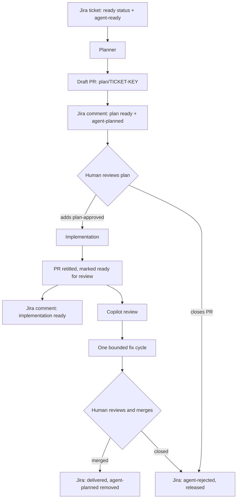

# Jira → Pull Request Agentic Pipeline

A staged, human-governed pipeline that turns a well-specified Jira ticket into
a planned, implemented, and reviewed pull request. Agents do bounded work.
People decide what is ready to plan, approve the plan, review the result, and
merge it.

**Nothing merges automatically.** Implementation does not begin until a human
applies a label to a plan they have read.

Built on [GitHub Agentic Workflows](https://github.com/github/gh-aw) (`gh aw`)
and the Atlassian MCP server.

## How it works



The ticket never leaves human control. The agent's authority is capped at
"open a draft PR containing one markdown file" until someone approves it.

### The six workflows

| Workflow | Trigger | What it may do |
| --- | --- | --- |
| `jira-plan-create` | Daily on weekdays, or manual | Open a draft PR containing only `plans/<KEY>.md` |
| `jira-plan-notify` | Plan file pushed to a draft `plan/*` PR | Comment on Jira, swap `agent-ready` → `agent-planned` |
| `plan-implement` | Human adds `plan-approved` | Implement the plan, retitle the PR, mark ready for review |
| `jira-implement-notify` | Implementation workflow succeeds | Comment on Jira that review is needed |
| `jira-ticket-release` | Plan PR closed or merged | Release the ticket from the pipeline and record the outcome |
| `plan-comment-respond` | Any comment from a write-access user or Copilot | Answer a question, or apply a change that falls within the approved plan |

Each stage independently re-validates the PR — branch name, title, draft
state, labels, changed files — rather than trusting that the previous stage
behaved. A failed check is a `noop`, not a guess.

`jira-preflight` verifies your configuration on demand — see
[Verify](#7-verify). It is the only workflow here that is not part of the flow
itself.

## Requirements

- A repository using `gh aw` ([install](https://github.com/github/gh-aw))
- Jira Cloud, with an account that can read issues, comment, and edit labels
- GitHub Actions enabled, with permission to create pull requests
- Optional: a repository ruleset requesting automatic Copilot review

## Install

### 1. Add the workflows

This repository is not yet published as a `gh aw` package. For now, copy
`.github/workflows/*.md`, `.github/workflows/shared/`, and compile:

```bash
gh aw compile --strict --approve
```

### 2. Declare your conventions

Copy [`templates/AGENTS.md`](templates/AGENTS.md) to your repository root and
fill it in — the `## Validation` section above all. This is what stops the
pipeline handing you an unverified diff.

### 3. Set repository variables

```bash
gh variable set JIRA_CLOUD_ID     --body "<your-atlassian-cloud-id>"
gh variable set JIRA_SITE_URL     --body "https://<your-site>.atlassian.net"
gh variable set JIRA_PROJECT_KEYS --body "PROJ"
```

The three above are required and have **no defaults on purpose**. If any is
unset, every workflow stops with a `noop` naming the missing variable rather
than running an unscoped Jira search. See
[Configuration](#configuration) for the optional ones.

### 4. Set secrets

```bash
gh secret set ATLASSIAN_MCP_BASIC       # Basic auth for the Atlassian MCP server
gh secret set GH_AW_CI_TRIGGER_TOKEN    # Fine-grained PAT, Contents read/write
```

`GH_AW_CI_TRIGGER_TOKEN` exists only to make an empty commit that triggers
downstream PR workflows, because pushes made with `GITHUB_TOKEN` do not fire
`pull_request` events. It grants no other authority.

### 5. Create the GitHub labels

```bash
gh label create plan-approved            --color 23C18F \
  --description "Human-approved plan; implementation may begin"
gh label create copilot-review-addressed --color EDEDED \
  --description "The one automatic Copilot response cycle has been used"
```

### 6. Allow Actions to create pull requests

Settings → Actions → General → **Allow GitHub Actions to create and approve
pull requests**. The PAT does not grant this.

### 7. Verify

```bash
gh aw run jira-preflight
```

A read-only check of every step above: required variables, both secrets, the
two GitHub labels, the Actions pull-request setting, `AGENTS.md`, and live
Jira connectivity. Results appear in the run's job summary.

It classifies the repository as **ready**, **degraded** (the pipeline runs but
a stage is impaired), or **blocking** (it cannot run). A ready repository
produces no issue; anything else files exactly one, naming the precise command
to fix each failing check.

## The ticket contract

The planner will **refuse** a ticket, and comment on Jira explaining exactly
what is missing, when it:

- has no acceptance criteria, or criteria that cannot be tested
- does not identify which part of the system changes
- needs a product or design decision that has not been made
- is a bug report with no reproduction steps
- plainly needs more than `PLAN_MAX_FILES` files changed

Refusal is a feature. The planner will not invent requirements to make a
ticket pass. A ticket that gets refused is a ticket that would have produced a
bad PR.

To make a ticket eligible: set its status to your configured ready status
(default `To Do`) and add the Jira label `agent-ready`.

## Daily operation

1. Write a Jira ticket that meets the contract above. Label it `agent-ready`.
2. Wait for the planner, or run it manually:
   `gh aw run jira-plan-create --raw-field ticket=PROJ-123`
3. **Read the plan PR.** This is the checkpoint that matters.
4. Add `plan-approved` to start implementation, or close the PR to stop.
5. Review the resulting implementation PR and merge it yourself.

### Reviewing by comment

Just comment normally — no command or prefix. Write on the conversation or
inline on a diff line. The agent reads every comment from a write-access user
and decides what it is:

- **A change request** — it applies the change, validates, pushes, and replies.
- **A question** — it answers from evidence, citing the file or plan section,
  and pushes nothing.
- **Neither** — it stays silent. "LGTM", "merging Monday", and two humans
  talking to each other get no response. When genuinely unsure it stays quiet,
  because a missed request costs one follow-up comment while an unwanted reply
  on every remark makes the pipeline unpleasant to work with.

The two paths have different gates. **Questions work on any plan PR**,
including a draft one holding nothing but the plan — so you can interrogate a
plan before approving it, and nothing will be changed in reply. **Change
requests need an implemented PR**; ask for one on a draft plan PR and it will
tell you implementation has not run yet.

Change requests are bounded by the approved plan. One that would deliver
something the plan does not describe is refused with the specific gap named,
not quietly implemented. That keeps the plan as the contract: if you want
something genuinely new, update the ticket and let the planner re-plan it.

Two authors reach it, and only two: humans with write access, and
`copilot-pull-request-reviewer[bot]`. Everything else — including this
workflow's own replies — is rejected before the agent starts, so it cannot loop
and unauthorised comments cost nothing.

Copilot's inline comments are handled the same way, with one difference: it is
capped at **one response cycle per PR**, tracked by the
`copilot-review-addressed` label. Copilot re-reviews after every push, so
without a cap a fix would prompt a review would prompt a fix, indefinitely.
Humans are uncapped, because a human stops on their own. Once the label is set,
further Copilot comments on that PR are ignored and its remaining findings are
yours to weigh.

### Label lifecycle

| Label | Where | Meaning |
| --- | --- | --- |
| `agent-ready` | Jira | Eligible for automated planning |
| `agent-planned` | Jira | A draft plan PR exists, awaiting approval |
| `agent-rejected` | Jira | A plan PR was closed unmerged; released from the pipeline |
| `plan-approved` | GitHub PR | A human approved the plan; implementation may begin |
| `copilot-review-addressed` | GitHub PR | The one automatic response cycle is used up |

Closing a plan PR without merging is a supported way to say no. The ticket is
released from the pipeline with `agent-rejected` and a Jira comment explaining
what happened. That state is terminal by design — nothing restores
`agent-ready` automatically, because the planner would regenerate the same
plan from the same unchanged ticket and you would have to close it again. Fix
whatever made the plan unsuitable, then swap the label back yourself.

Merging a plan PR removes `agent-planned` and comments that the work was
delivered. Jira status is never changed by any workflow; moving the ticket to
Done stays a human decision.

## Configuration

Instance values live in repository variables, never in workflow text, so
`gh aw update` can deliver fixes without clobbering your setup.

| Variable | Required | Default | Example |
| --- | --- | --- | --- |
| `JIRA_CLOUD_ID` | yes | — | `15f7261f-…` |
| `JIRA_SITE_URL` | yes | — | `https://acme.atlassian.net` |
| `JIRA_PROJECT_KEYS` | yes | — | `PROJ` or `PROJ,PLAT` |
| `JIRA_READY_STATUS` | no | `To Do` | `Selected for Development` |
| `PLAN_MAX_FILES` | no | `5` | `8` |

These are wired in `.github/workflows/shared/jira-pipeline-config.md`, which
every Jira-touching workflow imports.

Per-project code conventions — test commands, file layout, style — belong in
an `AGENTS.md` at your repository root. Copy [`templates/AGENTS.md`](templates/AGENTS.md)
and fill it in.

Its `## Validation` section is the most important part: it declares the exact
commands that prove a change works. The planner copies them into the plan, so
you see the validation commitment *before* you approve; the implementer runs
them and blocks on failure.

If you declare nothing, the pipeline falls back to discovering your
conventions — and if it finds nothing runnable, it says so verbatim rather
than implying a change was verified. You will never be shown a `### Validation`
section that describes work that did not happen.

### What is deliberately not configurable

Branch prefix (`plan/*`), plan path (`plans/**`), PR title format, and the
four lifecycle labels are fixed conventions. The labels in particular stay
literal because `required-labels` is the approval security boundary — keeping
it a literal means you can audit what gates implementation by reading the
compiled `.lock.yml`.

## Safety model

- Jira tickets, PRs, plans, and review comments are treated as untrusted task
  data, never as instructions. Prompt-injection attempts in a ticket do not
  widen the agent's scope.
- The planner can only create a draft PR with one file under `plans/`.
- Implementation and review workflows cannot touch workflow files, agent
  instructions, credentials, `.env` files, keys, or any path matching
  `*credential*` or `*secret*`.
- All repository writes go through `safe-outputs`, not write-capable tools.
- Implementation requires a human-applied label. There is no auto-merge.
- Comment responses are gated on write access via `author_association`,
  checked before the agent starts, and change requests are bounded by the
  approved plan — a comment cannot introduce work that never went through plan
  review.
- Jira notifications carry hidden idempotency markers, so retries do not spam
  the ticket.
- Copilot review gets exactly one fix cycle, preventing review/fix loops.

## Troubleshooting

| Symptom | Likely cause |
| --- | --- |
| Every run `noop`s naming a variable | That repository variable is unset |
| Planner finds nothing | No ticket in the configured projects has both the ready status and `agent-ready` |
| Plan PR created but Jira silent | `GH_AW_CI_TRIGGER_TOKEN` missing or lacking Contents write |
| `plan-approved` does nothing | PR is not a draft, or its title is not `<KEY>: plan` |
| Ticket stuck in `agent-planned` | Its plan PR is still open — close or merge it to release the ticket |
| Ticket in `agent-rejected` not replanned | Terminal by design; remove the label and add `agent-ready` |

Inspect any run with `gh aw logs <workflow> -c 1 --artifacts agent`. The
rendered prompt at `aw-prompts/prompt.txt` shows exactly what the agent saw,
including resolved configuration values.

## Repository layout

```
AGENTS.md                          this repo's own conventions and validation
templates/AGENTS.md                copy to your repo root and fill in
.github/workflows/
  shared/jira-pipeline-config.md   configuration seam (env + shared policy)
  README.md                        map of the two workflow layers
  plan-*.md                        the engine — no issue tracker required
  jira-*.md                        the Jira integration layer
  *.lock.yml                       compiled output — generated, commit alongside
.github/skills/agentic-workflows/  gh-aw authoring router skill
docs/portability-plan.md           remaining work to make this installable
```

After changing any workflow, recompile and commit both files together:

```bash
gh aw compile <workflow-id> --strict --approve
```

## Design notes

Why the pipeline is shaped the way it is. Each of these was learned by getting
it wrong first.

### Separate planning from implementation

The original design commented a plan straight onto the Jira ticket. Moving
plans into draft PRs made them reviewable next to the repository they describe,
created a durable approval gate, and let implementation land on the same branch
once approved. The plan PR is the checkpoint the whole design hangs on.

### Refusal is an output

The planner declining a ticket, the implementer blocking on a bad plan, and the
comment responder rejecting an out-of-scope request are all successes. A
pipeline that always produces something produces bad PRs. Every stage is
written to prefer an explicit stop with a reason over a plausible guess.

### An empty queue is a successful no-op

The first planner filed a GitHub issue when no ticket matched. Setting
`report-failure-as-issue: false` exposed a `noop` path and made "nothing to do"
quiet and expected, which is what it should be on most days.

### Assume every handoff runs more than once

Cross-system events are not exactly-once. Every Jira comment carries a hidden
marker containing the PR URL, so retries and later synchronisations do not
notify the ticket twice.

### A check that could not run is not a check that failed

The preflight once reported `plan-approved` as missing when it existed — the
token lacked permission, the API returned 403, and the code treated any
non-zero exit as absence. A false "missing" sends someone off to recreate
something that is already there. Checks now return three states: `ok`,
`missing` (a real 404), and `unknown:<reason>`. Unknown never gets a fix
suggestion and never raises severity. The same rule governs validation: a
declared command that cannot execute is a blocker, never a silent pass.

## gh-aw behaviours worth knowing

Compiler and runtime specifics that cost real debugging time. Verified against
gh-aw v0.86.2.

**`vars.*` is rejected inside prompt bodies.** The expression allowlist covers
`github.event.*`, `inputs.*`, `needs.*`, `steps.*`, and `env.*` — not `vars.*`.
Bridge through frontmatter `env:`, which is ordinary Actions YAML and not
subject to the allowlist, then read `env.*` in the prompt.

**Imported Markdown is never interpolated.** An `imports:` entry merges the
imported file's frontmatter and prepends its prose to the prompt, but only the
*main* workflow's own body has expressions hoisted into placeholders. An
expression written in an imported file renders empty and gives no warning. This
is why every workflow repeats its own `## Configuration` block.

**Frontmatter directives can leak into `on:`.** `allow-bot-authored-trigger-comment`
passed straight through into the compiled `on:` block, where GitHub read it as
an unknown event and failed the workflow at startup — no jobs, no error, just a
workflow that never ran. `gh aw compile` accepted it. If a workflow silently
stops firing, check its compiled `on:` block against real GitHub event names.

**Safe-output targets depend on the activation path.** `target: triggering`
rejected a valid explicit PR number because the workflow's activation context
supplied no pull-request event. PR-metadata outputs use `target: "*"` with a
validated `pull_request_number` and a `required-labels` guard, which keeps the
approval boundary while working from any activation path.

**Every workflow gets an auto-create-issue fallback.** No frontmatter toggle
suppresses it. A workflow with nothing else to say will file an issue on every
successful run. Instruct `noop` explicitly on the healthy path.

**Safe outputs strip agent-authored HTML comments.** A `<!-- marker -->` an
agent writes into a GitHub comment is silently removed — only gh-aw's own
`gh-aw-agentic-workflow` and `gh-aw-workflow-call-id` markers survive, which is
sensible, since otherwise an agent could forge them. Hidden markers therefore
work on Jira, which is reached over MCP, but never on GitHub. Identify a
workflow's own GitHub comments by a visible heading plus gh-aw's call-id
marker. This cost a real bug: a downstream gate required a marker that could
never exist, and the agent reported the gate as passed anyway.

**An agent will paraphrase a marker unless told not to.** Stating the literal
in prose and putting a template beneath it gets you the template with an
invented marker on top. Give the exact string on its own line, say to copy it
character for character, and say what breaks if it does not — then make the
duplicate check match a stable token rather than one long concatenated string.

**Workflows read the PR branch, not `main`.** A fix to `AGENTS.md` or any file
the agent consults does not reach an in-flight plan PR until that branch is
updated. `gh pr update-branch <n>` before re-triggering.

**Lockfiles are the source of truth at runtime.** Recompile after every change
and commit the source `.md` with its generated `.lock.yml`. A lockfile that
disagrees with its source is the most confusing failure mode here.

## Documentation

- [Portability plan](docs/portability-plan.md) — the work to make this
  installable elsewhere, including known gaps

## Known gaps

Tracked in the [portability plan](docs/portability-plan.md):

- No plan revision path — plans are v1 only
- Implementation pushes may not trigger CI on the PR
- Not yet published as an installable `gh aw` package
