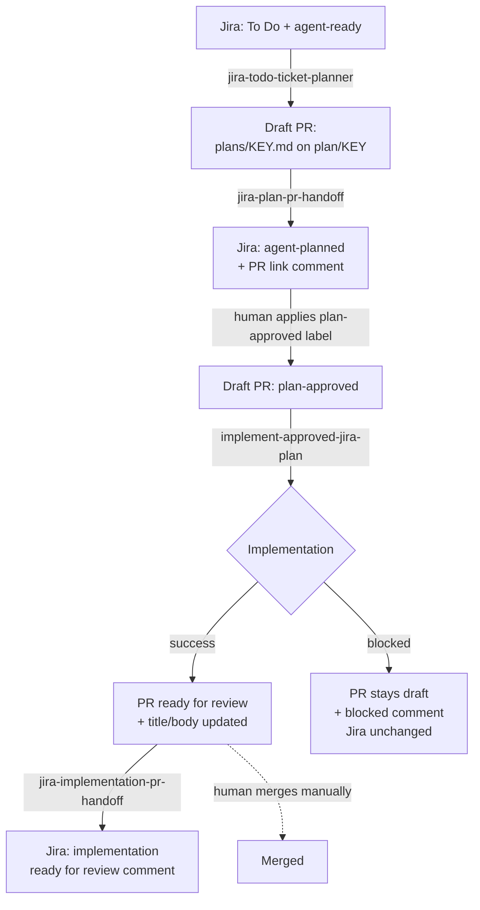

# Jira-to-implementation agent workflow

This document explains how this repository's agentic workflows
(`.github/workflows/*.md`) automate a Jira ticket from `To Do`/`agent-ready`
through a reviewed, implemented pull request. It is documentation only — it
does not change any workflow behavior.

## Overview

A ticket moves through four automated stages, with a human decision point
between planning and implementation:

1. **Ticket intake** — a planner workflow selects one eligible ticket and
   opens a draft pull request containing an execution plan.
2. **Plan review** — a handoff workflow links that pull request back to the
   Jira ticket and updates its label so a human knows to review the plan.
3. **Implementation approval** — a human reviewer applies the
   `plan-approved` label to the draft pull request, which triggers automated
   implementation on the same branch.
4. **Implementation review** — after implementation succeeds, the pull
   request leaves draft status and a handoff workflow posts a Jira comment
   stating the implementation is ready for human review.

At every stage, **pull requests are never merged automatically** by any of
these workflows. Merging is always a manual, human action.

## Ticket intake

Workflow: `.github/workflows/jira-todo-ticket-planner.md`

- Eligibility: the ticket's Jira status must be exactly `To Do` and its
  labels must include `agent-ready`.
- The workflow selects a ticket (a specific key via `workflow_dispatch`
  input, or the highest-priority/oldest-updated match via JQL search), checks
  it is actionable (has testable acceptance criteria, identifies affected
  system parts, and does not require more than five files or an unmade
  product/design decision), and writes `plans/<TICKET-KEY>.md`.
- It then opens a **draft** pull request containing only that plan file, on
  branch `plan/<TICKET-KEY>`, titled `<TICKET-KEY>: plan`.
- If the ticket is not actionable, the workflow adds a Jira comment
  explaining what is missing and does not open a pull request.

## Plan review

Workflow: `.github/workflows/jira-plan-pr-handoff.md`

- Triggers on synchronize of a draft pull request whose head branch starts
  with `plan/` and that changes only `plans/<TICKET-KEY>.md`.
- Validates the pull request is a draft, titled `<TICKET-KEY>: plan`, on
  branch `plan/<TICKET-KEY>`, and changes exactly that one plan file.
- Adds a Jira comment (marked `<!-- jira-ticket-planner:v2 -->`) linking the
  pull request and stating that applying `plan-approved` will trigger
  implementation.
- Replaces the ticket's `agent-ready` label with `agent-planned`, keeping all
  other labels unchanged.
- Uses the `ATLASSIAN_MCP_BASIC` secret to authenticate to Jira.

## Implementation approval

A human reviewer reviews the plan pull request and, when satisfied, applies
the `plan-approved` label to it. This label is the sole trigger for
automated implementation — no other event starts this stage.

## Implementation

Workflow: `.github/workflows/implement-approved-jira-plan.md`

- Triggers when a draft pull request on a `plan/*` branch is labeled
  `plan-approved`.
- Validates the pull request is a draft with the `plan-approved` label, on
  branch `plan/<TICKET-KEY>`, titled `<TICKET-KEY>: plan`, and changes
  exactly one file: `plans/<TICKET-KEY>.md`.
- Reads the plan and implements its explicit, approved steps as the smallest
  complete change supported by the plan and repository evidence. It does not
  modify the plan file, workflow files, action files, agent instructions,
  credentials, or environment files.
- Runs relevant existing validation for the changed code.
- On success, in order: pushes the implementation to the same pull request
  branch, replaces the pull request title/body with a summary of the change
  (`## Summary`, `## Jira`, `## Implementation`, `## Validation`,
  `## Planning record`), marks the pull request ready for review (leaving
  draft status), and adds an `## Implementation complete` comment.
- If the plan is ambiguous, incomplete, or cannot be implemented within the
  allowed files, it makes no changes and instead adds an
  `## Implementation blocked` comment describing the blocker. The pull
  request stays in draft and Jira is not updated.

## Implementation review

Workflow: `.github/workflows/jira-implementation-pr-handoff.md`

- Triggers after the implementation workflow run completes successfully on a
  `plan/*` branch.
- Validates the pull request's title matches the plan's H1
  (`<TICKET-KEY>: <ticket summary>`), it is no longer a draft, it has the
  `plan-approved` label, it changed `plans/<TICKET-KEY>.md` plus at least one
  other file, and it carries a comment marked
  `<!-- jira-ticket-implementation:v1 -->` with `## Implementation complete`.
- Confirms the Jira ticket has the `agent-planned` label, then adds a Jira
  comment (marked `<!-- jira-ticket-implementation:v1 pr:<PR-URL> -->`) with
  the `## Implementation ready for review` heading, the pull request URL, and
  the changed-areas/validation summary copied from the pull request comment.
- Uses the `ATLASSIAN_MCP_BASIC` secret to authenticate to Jira.

## Related workflows

- `.github/workflows/respond-to-copilot-review.md` — applies one bounded
  automatic fix cycle to a `plan-approved` pull request after a submitted
  GitHub Copilot code review, pushing fixes to the same branch and labeling
  the pull request `copilot-review-addressed`. Requires the
  `GH_AW_CI_TRIGGER_TOKEN` secret to trigger CI on the agent-pushed commit.
- `.github/workflows/jira-todo-console.md` — an auxiliary, read-only console
  workflow that lists FEAT project tickets with status `To Do`; makes no
  changes to Jira or GitHub.
- `.github/workflows/daily-activity-report.md` — an unrelated scheduled
  report summarizing repository commits, issues, pull requests, and releases
  over the last 24 hours; not part of the Jira intake-to-implementation
  chain.

## Required secrets

- `ATLASSIAN_MCP_BASIC` — Basic-auth credential used to authenticate to the
  Jira Cloud MCP server for reading tickets and posting/updating comments and
  labels.
- `GH_AW_CI_TRIGGER_TOKEN` — token used when pushing agent-authored commits
  so that pushes reliably trigger downstream CI/workflow runs.

No secret values are included or required here — only their names and
purposes.

## Recovering from a blocked plan or implementation

- **Blocked planning**: the planner workflow leaves a Jira comment naming
  what is missing. A human updates the ticket (acceptance criteria, scope,
  decisions) and re-runs the planner, or triggers it manually with the
  ticket key via `workflow_dispatch`.
- **Blocked implementation**: the implementation workflow leaves an
  `## Implementation blocked` comment on the pull request and makes no
  changes. A human can update the plan file, then re-apply (or re-add) the
  `plan-approved` label to re-trigger implementation.
- **Stuck labels/comments**: if automation cannot proceed because a label or
  comment marker is missing or out of sync, a human may manually adjust Jira
  labels or add the expected pull request comment/label to unblock the next
  workflow in the chain.

## End-to-end flow



Text fallback:

```
To Do + agent-ready
  -> [jira-todo-ticket-planner] -> draft PR (plans/KEY.md, branch plan/KEY)
  -> [jira-plan-pr-handoff] -> Jira label agent-planned + PR link comment
  -> [human applies plan-approved label]
  -> [implement-approved-jira-plan]
       success -> PR ready for review, title/body updated
       blocked -> PR stays draft, blocked comment, Jira unchanged
  -> [jira-implementation-pr-handoff] -> Jira "ready for review" comment
  -> [human merges manually]  (never automatic)
```
