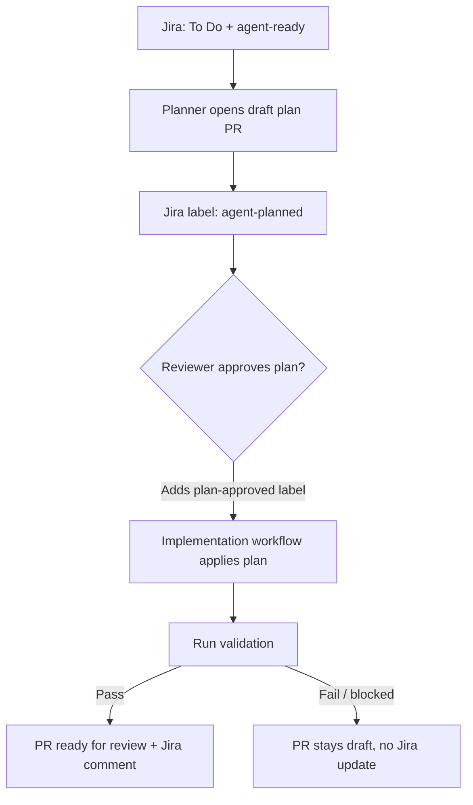

# Jira-to-Implementation Agent Workflow

This document describes the end-to-end automated workflow that takes a Jira
ticket from planning through implementation and review. The workflow is
composed of a small set of cooperating automations that read and update
Jira, and open and update GitHub pull requests, but never merge those pull
requests automatically.

## Ticket intake

- A ticket is eligible for automated planning when it is in `To Do` status
  and labeled `agent-ready`.
- The planner workflow selects exactly one eligible ticket and opens a draft
  pull request containing a proposed implementation plan for that ticket.

## Plan review

- The draft pull request contains a single new plan file,
  `plans/<TICKET-KEY>.md`, describing the scope, acceptance criteria,
  implementation steps, and validation approach for the ticket.
- The Jira ticket receives a "plan ready for review" comment containing a
  link to the draft pull request.
- The Jira ticket's label transitions from `agent-ready` to `agent-planned`,
  signaling that a plan exists and is awaiting human review.

## Implementation approval

- A human reviewer reviews the plan file and, if it is acceptable, adds the
  `plan-approved` label to the draft plan pull request.
- The implementation workflow detects the `plan-approved` label and applies
  the approved plan directly on the same pull request branch.

## Implementation review

- The implementation workflow runs whatever validation is applicable to the
  target repository (tests, build, and/or lint steps, as defined by that
  repository).
- If validation passes, the pull request moves out of draft status and
  becomes ready for human review. The Jira ticket receives an
  "implementation ready for review" comment that includes the pull request
  link, a summary of the changed areas, and the validation results.
- If the implementation is blocked or validation fails, the pull request
  remains in draft status and no Jira update is made.

## Operational guidance

### Required secrets

The workflow relies on the following GitHub repository secrets (names only;
no values are recorded here or anywhere in this document):

- `ATLASSIAN_MCP_BASIC`
- `GH_AW_CI_TRIGGER_TOKEN`

### Recovering from a blocked plan or implementation

If a plan or implementation is marked as blocked, add the missing details or
decisions to the Jira ticket description or to the pull request discussion,
then re-trigger the relevant workflow so it can proceed with the additional
context.

### Workflow responsibilities

- **Planner workflow** — selects an eligible Jira ticket and opens a draft
  plan pull request.
- **Implementation workflow** — applies an approved plan to its pull request
  branch and runs validation.
- **Post-PR handoff workflow** — posts Jira comments and updates ticket
  labels to reflect plan and implementation review status.

## End-to-end flow

## Merging is manual

Pull requests opened or updated by this automation are **never merged
automatically**. Merging remains a manual, human step at all times.
