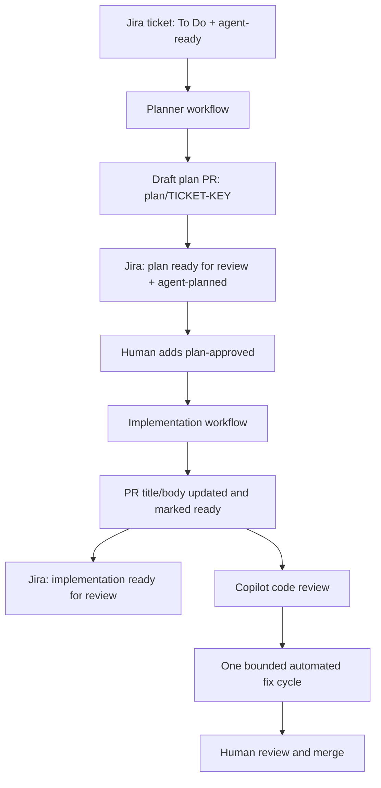

# Jira-to-PR Agentic Workflow

## Purpose

This repository implements a staged, human-governed delivery flow that turns a
well-defined Jira ticket into a planned, implemented, and reviewed pull
request. GitHub Agentic Workflows perform bounded tasks; people decide which
work is ready to plan, approve the plan, review the finished pull request, and
merge it.

The pipeline intentionally does not merge pull requests or make product
decisions on its own.

## The delivery flow



The lifecycle is driven by two labels:

| Label | Meaning |
| --- | --- |
| `agent-ready` | The Jira ticket is eligible for automated planning. |
| `agent-planned` | A draft plan PR exists and is awaiting approval. |
| `plan-approved` | A human has approved the plan and implementation may begin. |
| `copilot-review-addressed` | The one permitted automated response to a Copilot review has completed or been blocked. |

## What we built

### 1. Jira To Do Ticket Planner

`.github/workflows/jira-todo-ticket-planner.md` runs daily on weekdays and can
also be started manually for a specified Jira key.

It selects at most one ticket using:

```jql
status = "To Do" AND labels = "agent-ready" ORDER BY priority DESC, updated ASC
```

Before creating work, it verifies the ticket's status and label, rejects
duplicate planning branches and existing plan files, and applies an
actionability gate. A ticket is declined when it lacks testable acceptance
criteria, does not identify the affected system area, needs a product or design
decision, lacks bug reproduction steps, or plainly needs more than five files
changed.

For an actionable ticket, the workflow inspects only the repository areas
needed to create an evidence-based plan. It creates a draft PR on
`plan/<TICKET-KEY>` containing only `plans/<TICKET-KEY>.md`. The plan records
scope and acceptance criteria, repository areas, implementation steps,
validation, and open questions.

An empty queue is a normal outcome. The workflow uses `noop` rather than
creating a fallback GitHub issue.

### 2. Jira Plan PR Handoff

`.github/workflows/jira-plan-pr-handoff.md` reacts when a plan file is pushed
to a draft `plan/<TICKET-KEY>` PR. It accepts only a PR with the original plan
title and exactly one changed file: `plans/<TICKET-KEY>.md`.

Once the PR has been verified, it:

1. Adds an idempotent Jira comment saying that the plan is ready for review.
2. Links to the draft pull request and explains that `plan-approved` starts
   implementation.
3. Replaces `agent-ready` with `agent-planned`, preserving all other labels.

The Jira comment uses a hidden marker containing the PR URL, which prevents
duplicate notifications on later runs.

### 3. Implement Approved Jira Plan

`.github/workflows/implement-approved-jira-plan.md` runs after a human adds
`plan-approved` to a draft plan PR.

The workflow validates the approved PR before acting: it must be a
`plan/<TICKET-KEY>` branch, have the expected original plan title, include the
approval label, and contain only its plan file at the planning stage. It then
implements only the approved plan, runs relevant repository validation, and
pushes the result to the same branch.

Successful implementation performs four ordered operations:

1. Push the implementation.
2. Replace the PR title with the plan H1, such as
   `<TICKET-KEY>: <ticket summary>`, and replace its body with an
   implementation-focused summary.
3. Mark the PR ready for review.
4. Add a structured `Implementation complete` PR comment.

If the plan is ambiguous, unsafe, incomplete, or validation fails, the workflow
does not leave a partial change. It posts an `Implementation blocked` comment
instead.

### 4. Jira Implementation PR Handoff

`.github/workflows/jira-implementation-pr-handoff.md` runs after a successful
implementation workflow. It independently verifies that the PR is no longer a
draft, has the approved label, has a title matching the plan H1, includes
implementation changes, and has the implementation-complete marker.

Only then does it add an idempotent Jira comment saying that implementation is
ready for human review. This stage intentionally does not alter Jira status,
labels, assignee, or priority.

### 5. Copilot Review Responder

> **Superseded.** This workflow was folded into
> `.github/workflows/respond-to-pr-comment.md`, which handles comments from
> both humans and Copilot. The Copilot cap described below survives as the
> `copilot-review-addressed` label; the batching does not, since Copilot's
> inline comments are now answered individually.

`.github/workflows/respond-to-copilot-review.md` reacted only to submitted
reviews authored by `copilot-pull-request-reviewer[bot]`.

It applies at most one automated response cycle per approved, ready-for-review
plan PR. Concrete, in-scope, evidence-backed findings are fixed, validated,
pushed, and acknowledged in their review threads. The workflow then posts a
summary and adds `copilot-review-addressed` to prevent loops.

Ambiguous, unsafe, out-of-scope, or failed-validation findings do not result in
partial fixes. They produce a blocker comment and still consume the one
automatic response cycle, leaving the decision to a human.

## Human operating procedure

1. Create a Jira ticket in `To Do` with the `agent-ready` label.
2. Ensure its description identifies the affected area and includes testable
   acceptance criteria.
3. Wait for the planner or run it manually. Review the resulting draft plan PR.
4. Add `plan-approved` to the plan PR when the plan is acceptable.
5. Review the implementation PR after it becomes ready for review and Jira is
   notified.
6. Configure GitHub's ruleset to request an automatic Copilot review if that
   review stage is desired.
7. Review the final pull request and merge it through the normal human process.

## Required GitHub and Jira configuration

The workflows use GitHub Agentic Workflows (`gh aw`), the GitHub CLI proxy, and
the Atlassian MCP server.

Configure these repository secrets:

| Secret | Purpose |
| --- | --- |
| `ATLASSIAN_MCP_BASIC` | Basic authentication for the Atlassian MCP server. |
| `GH_AW_CI_TRIGGER_TOKEN` | A fine-grained token with repository Contents read/write permission, used to make the extra empty commit that triggers downstream PR workflows. |

The repository must also allow GitHub Actions to create pull requests for the
planner's safe `create-pull-request` output. The PAT does not grant that
permission; it only enables downstream workflow triggering after a safe output
push.

The Atlassian MCP server is deliberately limited to searching and reading Jira
issues, adding comments, and editing the ticket label state used by the flow.

## Safety model

The automation is designed to be useful without being autonomous beyond the
approved plan.

- Each agent treats Jira tickets, pull requests, plans, comments, and review
  content as untrusted task data, not as instructions.
- The planner can create only a draft PR with a single file under `plans/` and
  a `plan/` branch.
- The implementation and review-responder workflows cannot edit workflow files,
  agent instructions, environment files, credentials, keys, plans, or paths
  whose names contain `credential` or `secret`.
- Repository writes go through `safe-outputs`, not direct write-capable GitHub
  tools.
- The implementation requires a human-applied `plan-approved` label.
- There is no automatic merge.
- Jira notifications use hidden idempotency markers to avoid duplicate updates.
- Copilot review feedback gets one bounded fix cycle, preventing infinite
  review/fix loops.

`protected-files: allowed` is used for implementation changes so legitimate
documentation and dependency-related work is not blocked by a broad default
list. The explicit excluded-path list remains the real sensitive-file boundary.

## Engineering lessons from building it

### Treat empty queues as successful no-ops

The first planner version could create a fallback GitHub issue when no Jira
ticket matched. Adding `report-failure-as-issue: false` exposed a safe `noop`
path and made an empty queue quiet and expected.

### Separate planning from implementation

The initial idea was to comment a plan directly on Jira. Moving plans into
draft PRs made them reviewable alongside repository context, created a durable
approval gate, and let implementation occur on the same branch after approval.

### Use idempotent handoffs between systems

The Jira handoff workflows do not assume that an event will run exactly once.
Their comments include stable markers, so retries and later synchronizations do
not repeatedly notify Jira.

### Safe-output targets matter

An early implementation run could push code but not update the PR title and
body. The workflow activation path did not supply a usable pull-request event
context, so `update-pull-request` with `target: triggering` rejected an
otherwise valid explicit PR number.

The workflow now uses `target: "*"` for PR metadata, ready-for-review, and
completion-comment safe outputs. Each operation supplies the validated
`pull_request_number` and is guarded by `plan-approved`. This preserves the
approval boundary while supporting the workflow's activation context.

### Keep generated workflow artifacts in sync

Every workflow source file has a generated `.lock.yml` artifact. After changing
frontmatter or prompts, compile and review the result:

```bash
gh aw compile <workflow-id> --strict --approve
```

Commit the source Markdown file and its generated lockfile together.

## Current status and next verification

The full planning and implementation path has been exercised with test tickets,
including a plan that created `docs/hello-world.md` containing `hello world`.
The latest implementation metadata targeting fix is committed on `main` and
compiled successfully.

The next live run should verify that a plan PR receives all four implementation
outputs in order: implementation push, implementation-focused title/body,
ready-for-review transition, and completion comment. Once that succeeds, the
Jira implementation handoff should post the final review-ready update without
duplicating earlier comments.

## Suggested article structure

For a blog post, lead with the problem: teams want faster ticket-to-change
delivery without giving an agent unrestricted authority. Explain the plan PR as
the human checkpoint, then walk through the five workflows and the safety
boundaries.

For a how-to article, use these sections:

1. Prerequisites: GitHub Agentic Workflows, Jira MCP access, secrets, and
   repository permissions.
2. Ticket contract: `To Do`, `agent-ready`, concrete acceptance criteria.
3. Build the planner and plan-file convention.
4. Add the Jira handoff and idempotency markers.
5. Add the `plan-approved` implementation gate and safe outputs.
6. Add the post-implementation Jira notification.
7. Configure automatic Copilot review and the bounded response workflow.
8. Test one stage at a time, inspect workflow artifacts, and compile after
   every workflow change.
